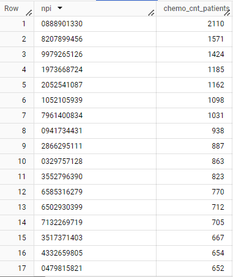

# CMPE 138 PROJECT: Healthcare Transparency

## Queries

### 1) 5 top and bottom care sites that offer chemotherapy based on the number of patients
No Optimization:
```
(SELECT
  DISTINCT care_site_id,
  COUNT(DISTINCT p.person_id) chemo_num_patients
  FROM `bigquery-public-data.cms_synthetic_patient_data_omop.procedure_occurrence` p
  JOIN `bigquery-public-data.cms_synthetic_patient_data_omop.provider` pro
    ON p.provider_id = pro.provider_id
  WHERE p.procedure_concept_id = 4289151
  GROUP BY 1
  ORDER BY 2 DESC
  LIMIT 5)

UNION ALL

(SELECT
  DISTINCT care_site_id,
  COUNT(DISTINCT p.person_id) chemo_num_patients
  FROM `bigquery-public-data.cms_synthetic_patient_data_omop.procedure_occurrence` p
  JOIN `bigquery-public-data.cms_synthetic_patient_data_omop.provider` pro
    ON p.provider_id = pro.provider_id
  WHERE p.procedure_concept_id = 4289151
  GROUP BY 1
  ORDER BY 2
  LIMIT 5)
```

With Optimization:
```
WITH chemo_sites AS (
  SELECT
    care_site_id,
    COUNT(DISTINCT p.person_id) AS chemo_num_patients
  FROM `bigquery-public-data.cms_synthetic_patient_data_omop.procedure_occurrence` p
  JOIN `bigquery-public-data.cms_synthetic_patient_data_omop.provider` pro
    ON p.provider_id = pro.provider_id
  WHERE p.procedure_concept_id = 4289151
  GROUP BY care_site_id
)
SELECT care_site_id, chemo_num_patients FROM (
  SELECT * FROM chemo_sites
  ORDER BY chemo_num_patients DESC
  LIMIT 5
) AS top_5
UNION ALL
SELECT care_site_id, chemo_num_patients FROM (
  SELECT * FROM chemo_sites
  ORDER BY chemo_num_patients
  LIMIT 5
) AS bottom_5;
)
```
Results:


### 2) Providers that provide chemotherapy
No Optimization:
```
SELECT npi,
  COUNT(DISTINCT p.person_id) chemo_cnt_patients
FROM `bigquery-public-data.cms_synthetic_patient_data_omop.procedure_occurrence` p
JOIN `bigquery-public-data.cms_synthetic_patient_data_omop.provider` pro
  ON p.provider_id = pro.provider_id
WHERE p.procedure_concept_id = 4289151
GROUP BY 1
ORDER BY 2 DESC
LIMIT 20
```

With Optimization:
```
SELECT npi,
  COUNT(DISTINCT p.person_id) chemo_cnt_patients
FROM `bigquery-public-data.cms_synthetic_patient_data_omop.procedure_occurrence` p
JOIN `bigquery-public-data.cms_synthetic_patient_data_omop.provider` pro
  ON p.provider_id = pro.provider_id
WHERE p.procedure_concept_id = 4289151
GROUP BY 1
ORDER BY 2 DESC
LIMIT 20
```
Results:



### 3) Top 10 chemotherapy procedures
No optimization:
```
SELECT
  concept_id,
  concept_name,
  vocabulary_id,
  COUNT(DISTINCT person_id) AS num_patients
FROM 
  `bigquery-public-data.cms_synthetic_patient_data_omop.procedure_occurrence` AS p
JOIN 
  `bigquery-public-data.cms_synthetic_patient_data_omop.concept` AS c
  ON p.procedure_concept_id = c.concept_id
WHERE 
  LOWER(c.concept_name) LIKE '%chemotherapy%'
GROUP BY 
  1, 2, 3
ORDER BY 
  num_patients DESC
LIMIT 10;
```

With Optimization
```SELECT
  concept_id,
  concept_name,
  vocabulary_id,
  COUNT(Distinct person_id) num_patients
FROM `bigquery-public-data.cms_synthetic_patient_data_omop.procedure_occurrence` p
JOIN `bigquery-public-data.cms_synthetic_patient_data_omop.concept` c
  ON p.procedure_concept_id = c.concept_id
WHERE LOWER(concept_name) LIKE '%chemotherapy%'
GROUP BY 1,2,3
ORDER BY 4 DESC
LIMIT 10
```

Results:


### 4) Top 10 drugs used in chemotherapy
No optimization:
```
SELECT
    c.concept_name AS drug,
    COUNT(DISTINCT d.drug_exposure_id) AS chemo_num_visits
FROM `bigquery-public-data.cms_synthetic_patient_data_omop.procedure_occurrence` p
JOIN `bigquery-public-data.cms_synthetic_patient_data_omop.drug_exposure` d
    ON p.visit_occurrence_id = d.visit_occurrence_id
JOIN `bigquery-public-data.cms_synthetic_patient_data_omop.concept` c
    ON c.concept_id = d.drug_concept_id
WHERE p.procedure_concept_id = 4289151
GROUP BY 1
ORDER BY chemo_num_visits DESC
LIMIT 10;
```

With Optimization
```
SELECT
    concept_name AS drug,
    COUNT(DISTINCT drug_exposure_id) chemo_num_visits
FROM `bigquery-public-data.cms_synthetic_patient_data_omop.procedure_occurrence` p
JOIN `bigquery-public-data.cms_synthetic_patient_data_omop.drug_exposure` d
    ON p.visit_occurrence_id = d.visit_occurrence_id
JOIN `bigquery-public-data.cms_synthetic_patient_data_omop.concept` c
    ON c.concept_id = d.drug_concept_id
WHERE p.procedure_concept_id = 4289151
GROUP BY 1
ORDER BY 2 DESC
LIMIT 10
```
Results:


### 5) Max and min percentage of how much patient and provider covers
No Optimization:
```
SELECT
  MAX(IF(total_paid != 0.00, paid_by_patient / total_paid, NULL)) AS max_percentage_patient_covers,
  MIN(IF(total_paid != 0.00, paid_by_patient / total_paid, NULL)) AS min_percentage_patient_covers,
  MAX(IF(total_paid != 0.00, paid_by_payer / total_paid, NULL)) AS max_percentage_provider_covers,
  MIN(IF(total_paid != 0.00, paid_by_payer / total_paid, NULL)) AS min_percentage_provider_covers
FROM `bigquery-public-data.cms_synthetic_patient_data_omop.cost`
```

With Optimization:
```
SELECT
  MAX(percent_patient_covers) AS max_percentage_patient_covers,
  MIN(percent_patient_covers) AS min_percentage_patient_covers,
  MAX(percent_provider_covers) AS max_percentage_provider_covers,
  MIN(percent_provider_covers) AS min_percentage_provider_covers
 
FROM (
  SELECT
    paid_by_patient/total_paid AS percent_patient_covers,
    paid_by_payer/total_paid AS percent_provider_covers
  FROM
    `bigquery-public-data.cms_synthetic_patient_data_omop.cost`
  WHERE total_paid != 0.00
)
```
Results:


### 6) 2nd most popular chemotherapy drug exposure time and observation time
No Optimization:
```
WITH get_drug_id AS (
    SELECT concept_name AS drug, drug_concept_id as dd
    FROM `bigquery-public-data.cms_synthetic_patient_data_omop.drug_exposure` d
    JOIN `bigquery-public-data.cms_synthetic_patient_data_omop.concept` c
        ON c.concept_id = d.drug_concept_id
    WHERE c.concept_name LIKE '%Sodium Chloride Injectable Solution%'
    LIMIT 1
),
get_person_id AS (
    SELECT
      d.person_id,
      DATE_DIFF(d.drug_exposure_end_date, d.drug_exposure_start_date, day)AS drug_time,
    FROM `bigquery-public-data.cms_synthetic_patient_data_omop.drug_exposure`d
    JOIN get_drug_id g ON d.drug_concept_id = g.dd
),
calc_date_diff AS (
    SELECT
        DATE_DIFF(o.observation_period_end_date, o.observation_period_start_date, day)AS observation_time
    FROM get_person_id as g
    JOIN `bigquery-public-data.cms_synthetic_patient_data_omop.observation_period` o
        ON o.person_id = g.person_id
)
SELECT
    ROUND(AVG(drug_time),2) avg_drug_exposure_time_in_days,
    ROUND(AVG(observation_time),2) avg_observation_time_in_days
FROM get_person_id, calc_date_diff
```

With Optimization:
```
WITH get_drug_id AS (
    SELECT
        concept_name AS drug,
        drug_concept_id as dd
    FROM `bigquery-public-data.cms_synthetic_patient_data_omop.drug_exposure` d
    JOIN `bigquery-public-data.cms_synthetic_patient_data_omop.concept` c
        ON c.concept_id = d.drug_concept_id
    WHERE c.concept_name LIKE '%Sodium Chloride Injectable Solution%'
    LIMIT 1
),

calc_date_diff AS (
    SELECT
    DATE_DIFF(d.drug_exposure_end_date, d.drug_exposure_start_date, day)AS drug_time,
    DATE_DIFF(o.observation_period_end_date, o.observation_period_start_date, day)AS observation_time
    FROM `bigquery-public-data.cms_synthetic_patient_data_omop.drug_exposure`d
    JOIN get_drug_id g
        ON d.drug_concept_id = g.dd
    JOIN `bigquery-public-data.cms_synthetic_patient_data_omop.observation_period` o
        ON o.person_id = d.person_id
)

SELECT
    ROUND(AVG(drug_time),2) avg_drug_exposure_time_in_days,
    ROUND(AVG(observation_time),2) avg_observation_time_in_days
FROM calc_date_diff
```
Results:


